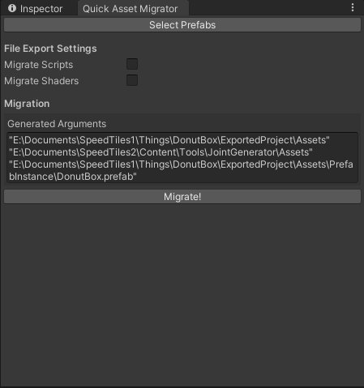

# Quick Asset Migrator

Quick Asset Migrator is an editor script for [Asset Migrator](https://github.com/zCubed3/asset_migrator) that
assists with quickly migrating assets between Unity projects from editor. No need to use a CLI!

## Usage

1. Download & import the latest Unity Package into your project
2. Download the latest version of Asset Migrator, and drag the `asset_migrator.exe` file underneath the `Assets/QuickAssetMigrator` folder in your Unity project.
3. Open the Quick Asset Migrator window from the `Tools` menu in Unity and get started!